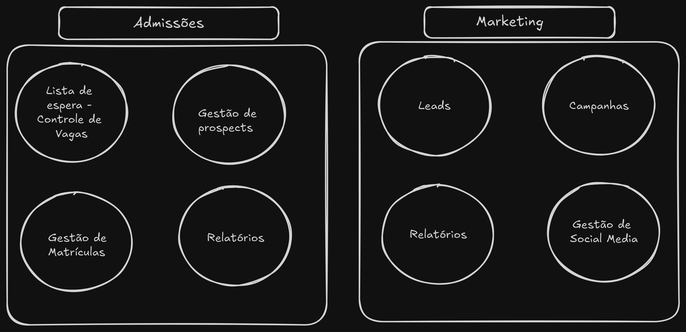

# Fase 1 / Aula 3 - domain-driven-design - Descoberta e formação do conhecimento

## Resumo

Nesta aula, discutimos a descoberta e formatação do conhecimento no contexto do Domain-Driven-Design (DDD). O foco é entender o desafio do negócio e criar uma linguagem única para se comunicar e documentar com o cliente. 

## Linguagem Ubíqua
Durante a descrição do cenário, o Domain Expert começa a uisar termos próprios do negócio, como testes, notas, sistema e outros que achamos que entendemos. Por exemplo, os paiis de uma criança que ainda estejam em processo de escolher uma escola são vistos de forma diferente pelos departamentos da mesma escola, como: admissão, marketing e secretaria. *Ou seja, a linguagem ubíqua serve para unificar a linguagem para que todos falem "um só idioma".*

- <b>Termos Ambíguos:</b>dentro de um subdomínio,podemos ter um mesmo termo com  vários  significados.Por  exemplo:política.Esse  termo  pode  significar  uma  lei regulatóriaou uma regra interna da escola.

- <b>Termos  Sinônimos:</b> dentro  de  um  subdomínio,podemos  ter  um termo  que é utilizado para vários significados que possuem muito mais detalhes.Por exemplo, em TI utilizamos sempre o termo login para referenciar o ato de efetuar autenticação no sistema, ou para referenciar a conta do usuário.

## Modelagem do Domínio

Ao criar um modelo do Domínio, estamos desenhando uma abstração de um processo do qual queremos resolver um problema. 

Essa documentação é essencial para que possamos conduzir as conversas com os Domain Experts e extrair tudo que é necessário para entender o problema. A lingaguem ubíqua que vimos é um passo muito importante na cominucação entre as partes. 

## Ferramentas

É importante catalogar e documentar tudo, de forma que posteriormente possamos compatilhar e manter atualizado na medida em que seguimos. 

Precismos montar uma estruta que nos dê suporte e seja fácil de se trabalhar, e isso significa pensar em todos os envolvidos no processo. 

Por exemplo: Uma Wiki que consolida os diversos recursos, tais como os listados:

- Wiki para ser a central do projeto, consolidando todos os recursos.
- Seção na Wiki com a descrição do time.
- Nosso dicionário (linguagem ubíqua)
- Link para nosso repositório no Githib/Bitcuket, e documentações.

## Contextos Delimitados (*Bounded Context*)

Identificamos  o domínio  e  seus subdomínios, como cada um “participa” do negócio e qual a sua parte na estratégia da empresa, então agora começamos a criar limites para a nossa solução, limites que não são definidos pelos subdomínios. 

### Como definir un bounded context e qual o tamanho que o mesmo pode atingir

- Não há uma regra para definir o tamanho de um bounded context.
- A linguagem ubíqua é uma ótima métrica, se a terminologia é a mesma em dois contextos e tratam os processos de forma muito parecidas. 
- Pode ser uma boa ideia juntar as duas no memso contexto, ou até o contrário. 
- Se forem muito distintos, separe-os para que possam ser implementados sem interferência. 

> *O tamanho deve ser o menor possível para que haja uma coesão maior, além de que mantendo ele pequeno nós garantimos uma granularidade modular maior.*

#### Importante ressaltar: 

> *O número de contextos pode mostrar o número de times que farão parte do desenvolvimento.*

> *Um time pode trabalhar em diversos bounded contexts, mas um bounded context só pode ser trabalhado por um time.*

> *Um contexto demilitado é sempre trabalhado por um tiem, nunca compatilhado entra dois, mas um time pode trabalhar em diversos contextos*.

EXEMPLO DE BOUNDED CONTEXT:

Então resumindo, contextos demilitados (bounded context) são limites que impomos em um modelo de domínio. Os limites contém as definções, propriedades, termos referente a uma linguagem única.

