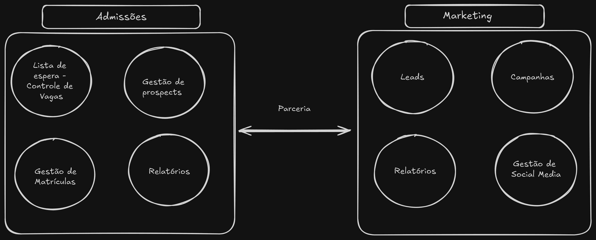
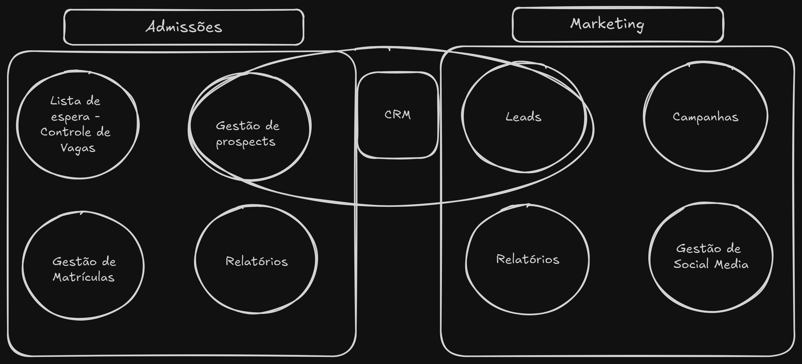
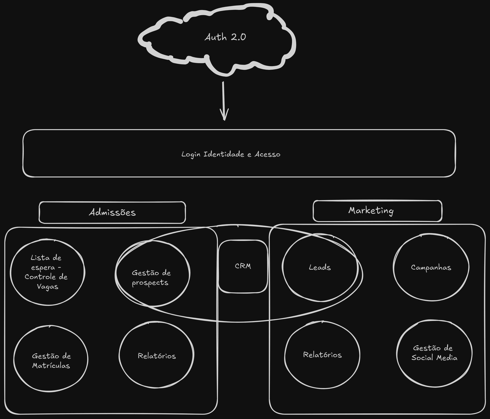

# Fase 1 / Aula 4 - domain-driven-design - Trabalhando com contextos delimitados (*bounded context*)

## Resumo

Nessa aula abordamos a integração entre diferentes contextos delimitados em projetos de desenvolvimento de software utilizando Domain-Driven Design (DDD). Utilizando um exemplo de projeto escolar, o conteúdo destacou como diferentes equipes, como admissões, marketing e autenticação, podem se integrar.

## Cooperação

Ao trabalhar com contextos demilitados, temos casos em que a comunicação é clara e objetiva entre os times, tendo assim colaboração total entre times.

Foram apresentados diversos modelos de integração: 

### Parceria
Comunicação frequente entre as equipes, especialmente no início do desenvolvimento. 

Exemplo:

### Kernel compartilhado
Quando dos contextos compartilham parte do modelo. Esse é um caso em que a comunicação deve ser essencial, pois teoricamente, viola todo o princípio dos contextos delimitados. 

Exemplo

### Cliente-fornecedor 

> *Forcedor: Upstream*   *Cliente: Downstream*

Um time desenvolve um contexto separado, mas há dependência de um serviço.

Exemplo:

### Conformista
O papel do conformista é aceitar que o fornedor não irá se adequar a nossa aplicação, por isso, nós temos que nos adequar a aplicação do cliente. 

### Camada anticorrupção: 
Abstrai diferenças de protocolo entre contextos.

### Serviço de host aberto: 
Um serviço padronizado é disponibilizado para o cliente.