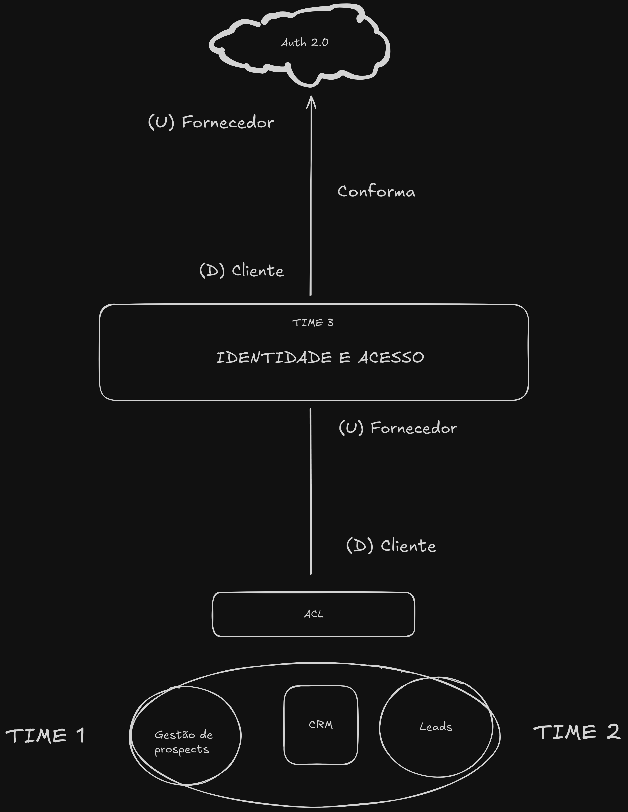

# Fase 1 / Aula 4 - domain-driven-design - Trabalhando com contextos delimitados (*bounded context*)

## Resumo

Nessa aula abordamos a integração entre diferentes contextos delimitados em projetos de desenvolvimento de software utilizando Domain-Driven Design (DDD). Utilizando um exemplo de projeto escolar, o conteúdo destacou como diferentes equipes, como admissões, marketing e autenticação, podem se integrar.

## Cooperação

Ao trabalhar com contextos demilitados, temos casos em que a comunicação é clara e objetiva entre os times, tendo assim colaboração total entre times.

Foram apresentados diversos modelos de integração: 

### Parceria
Comunicação frequente entre as equipes, especialmente no início do desenvolvimento. 

Exemplo:

### Kernel compartilhado
Quando dos contextos compartilham parte do modelo. Esse é um caso em que a comunicação deve ser essencial, pois teoricamente, viola todo o princípio dos contextos delimitados. 

Exemplo

### Cliente-fornecedor 

> *Forcedor: Upstream*   *Cliente: Downstream*

Um time desenvolve um contexto separado, mas há dependência de um serviço.

Exemplo:

### Conformista
O papel do conformista é aceitar que o fornedor não irá se adequar a nossa aplicação, por isso, nós temos que nos adequar a aplicação do cliente.

;

Quando  o  padrão  de  serviço  é  determinado  pelo fornecedor  (U)  e  este  não renuncia a seu protocolo, ou seja, ignora as demandas do cliente (D), este tem que “se conformar” e se adequar ao que o fornecedor o provê. Esse é o modelo conformista

### Camada anticorrupção (ACL - Anti-corruption Layer): 
Abstrai diferenças de protocolo entre contextos. Por exemplo:

;

Neste exemplo, temos uma situação em que o CRM, que tem o time 1 e 2 trabalhando, não aceita o tipo de padrão que vem do time 3, do contexto de identidade e acesso, e este não vai alterar seu protocolo para atender a demanda do CRM, que também não irá realizar modificações, assim isso gera um não conformismo. Com isso, o time 1 e dois criam uma camada para abstrair esse protocolo e criar o seu próprio modelo para manter a integridade da solução. 

Essa camada anti-corrupção (ACL) representa o modelo do exemplo acima. 

### Serviço de host aberto (O): 
Um serviço padronizado é disponibilizado para o cliente.

To be continue ... 