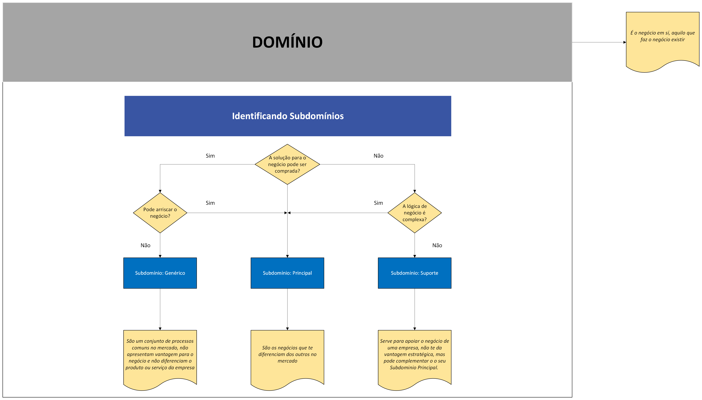

# Fase 1 / Aula 1 - domain-driven-design - discovery-domain

## Domínios e como identificar subdomínios

### Domínios
Nessa aula tivemos o exemplo de uma escola, o domínio da escola primária é a *<b>Educação</b>*, logo o domínio é o negócio em si, é o que a empresa faz. 

### Subdomínios Principais
Os Subdomínios Principais são os negócios que trazem o diferencial perante ao mercado.

Em um exemplo simples: 
- O Subdomínio Principal dos correios são seus serviços logísticos;
- O Subdomínio Principal da Air Canada são os voos

### Subdomínios Genéricos
São todos aqueles que possuem processos comuns de mercado, por exemplo, um portal de uma empresa, um e-commerce etc. 

São processos complexos, e que tem sua complexidade pois existem lógicas do negócio, mas não apresentam vantagens para o négocio. 

Seguindo o mesmo exemplo anterior:
- O Subdomínio Genérico dos correios é a contabilidade;

### Subdomínios de Suporte
Este apoia o negócio da empresa, porém ele não atual como princial. Ele não agrega vantagem estratégica para o negócio, porém serve de complemento para o Subdomínio Princial. 

## Como identificar os Subdomínios?

Para este caso, de forma mais fácil e visual podemos chegar a uma resposta para identificar um Subdomínio 

### Contexto dos casos

É importante levar em consideração o que cada um representa e seu contexto, para que seja possível gerar um mapeamento correto, por exemplo: 

- Utilizando o exemplo da escola, ela tem como Domínio a Educação que é o seu Core Domain, a contabiliade seria classificada como "Genérico" já que isso lhe da nenhuma vantagem de negócio. Por outro lado é importante ver o contexto da empresa contratada para realizar a contabilidade, ela sim trata a contabilidade como Subdominio Principal, pois é isso que eles oferem como diferencial, pois é o que agrega o valor direto ao negocio dela. 

